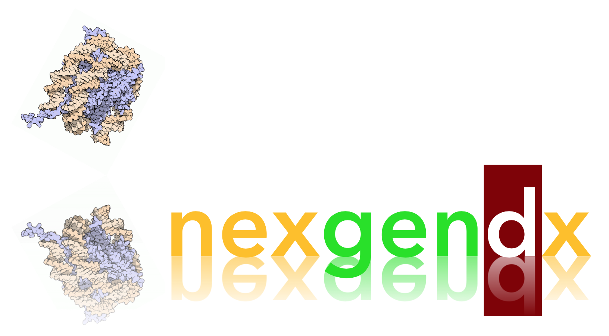

<br>

```py
[bash]~$ python3
>>> import nexgendx as ngs
>>> # simple command prompt example
>>> tumor_genome = ngs.teraget(, con=ngs.sqlalcmy(...))
>>> # do more
>>> 
```

<br>

## Next-gen sequencing analysis tools for circulating cell-free DNA. 
1. this
2. that
3. these
 - etc
 - etc 


<br>

## Getting Started

## License 


<br>


---------
<div align="center">


## Tools for the nucleosome cell-free DNA space.


####  ⊰♘𐃠♨︎𓍝⚔⊱ ``2017 | J.Collins``⚕⚕⚕ | ⚕ ``nexgendx``
### ➉❶①⓪🄵🅡ⓔⓔ🄲🅾ⓓⓔ㊝①➓➀


<br>

~~~py
(1*2^8 + 0*2^7 + 1*2^6 + 1*2^5 + 0*2^4 + 1*2^3 + 1*2^2 + 0*2^1 + 1*2^0) = 365
~~~

``@+++++++++++++++++++++++++++++++++++++++++++++++++++++++++++++++++++++++++++++++``
``𝝘𝝝𝝝𝝘𝝩𝝝𝝘𝝖𝝝𝝩𝝩𝝝𝝖𝝩𝝖𝝖𝝝𝝩𝝩𝝝𝝩𝝩𝝩𝝝𝝘𝝖𝝝𝝩𝝩𝝝𝝩𝝖𝝖𝝝𝝩𝝩𝝝𝝩𝝖𝝖𝝝𝝖𝝖𝝝𝝩𝝩𝝝𝝩𝝖𝝖𝝝𝝩𝝩𝝝𝝩𝝩𝝩𝝝𝝘𝝩𝝝𝝘𝝖𝝘𝝖𝝖𝝩𝝝𝝝𝝘``
``++++++++++++++++++++++++++++++++++++++++++++++++++++++++++++++++++++++++++++++++``
``DAEEEEDGGGIIIEJKKKJLKPKGGGGGGGGLGLGLKHHHHHKGGDJHHHHKGGDEJKKKJLKPKGGGGGKAAAAAABBJ``
``@+++++++++++++++++++++++++++++++++++++++++++++++++++++++++++++++++++++++++++++++``

<br>

<h6>[logo image source]:</h6>
<h4>See <a href="https://pdb101.rcsb.org/motm/7">Protein DataBank's Educational Portal</a> for more about nucleosomes.</h4>

</div
<br>


